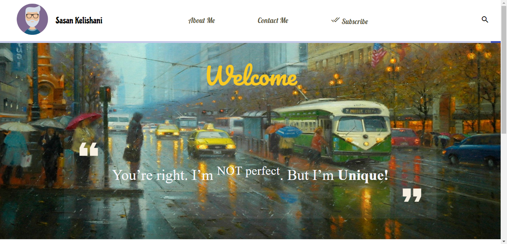

# **Simple Blog**

## `Work in progress`
 

# Looks

 
 

--- 
 
 

# **Todo**

#### 1 - Make blog `Responsive`
#### 2 - Add support for older browsers that do not support `grid layout`
#### ~~3 - Add view for `Articles`~~
#### ~~4 - Add `Comment` section for Articles~~
#### ~~5 - Add `Server Side` rendering support with angular universal~~

#### ~~6 - Add `Subscribe` , `Contact Me` and `About Me` pages~~

#### 7 - Add `databast` to store votes on artilces

#### 8 - Add `Admin` page for posting articles